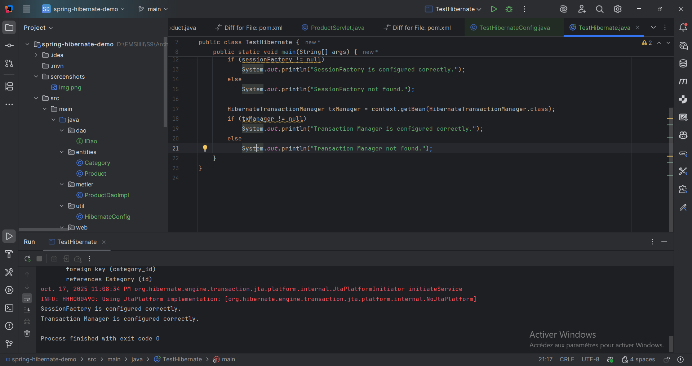
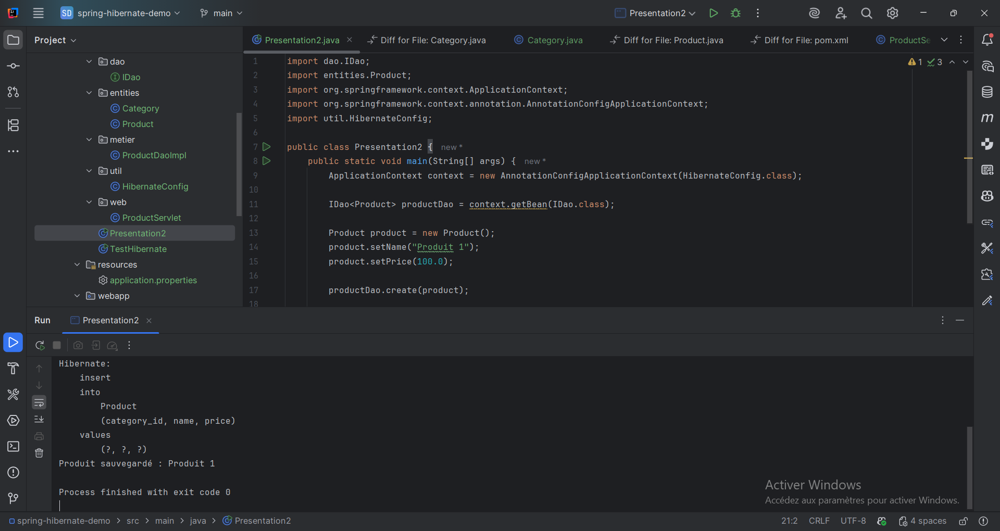
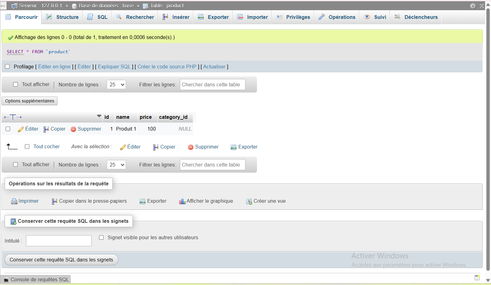
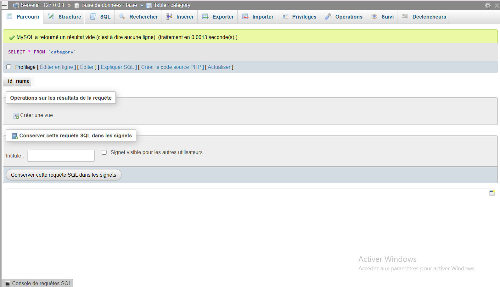
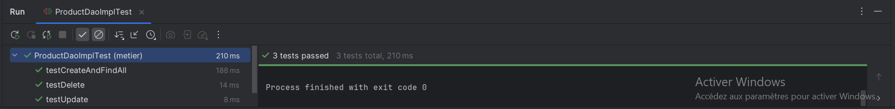
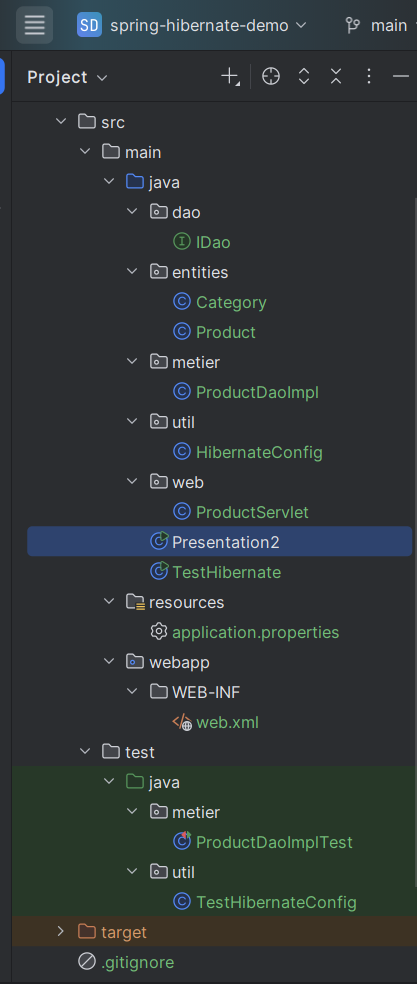

# TP — Intégration de Spring et Hibernate

Ce dépôt contient un projet qui montre comment marier Spring et Hibernate dans une application Java simple.

## Prérequis
- JDK 17 (ou version compatible)
- Maven
- MySQL accessible (les paramètres sont dans `src/main/resources/application.properties`)
- Dépendances Spring Framework et Hibernate ORM (gérées par Maven)

## Structure du projet
```
src/
  main/java/
    dao/IDao.java
    entities/{Product, Category}.java
    metier/ProductDaoImpl.java
    util/HibernateConfig.java
    web/ProductServlet.java
    Presentation2.java
    TestHibernate.java
  main/resources/application.properties
  main/webapp/WEB-INF/web.xml
  test/java/
    metier/ProductDaoImplTest.java
    util/TestHibernateConfig.java
```

## Démarrer rapidement
1) Clonez le dépôt puis ouvrez-le dans votre IDE.
2) Vérifiez/éditez `application.properties` pour pointer vers votre instance MySQL (URL, user, mot de passe, nom de base).
3) Build Maven (clean install) pour récupérer les dépendances et compiler.
4) Lancez les points de contrôle ci-dessous pour valider la configuration.

## Points de contrôle (pas à pas)

### 1) La configuration Hibernate démarre bien
Exécutez la classe `TestHibernate`. Le but est de vérifier que la `SessionFactory` et le `TransactionManager` sont créés sans erreur.



Dans la console, vous devez voir des messages du style :
- « SessionFactory is configured correctly. »
- « Transaction Manager is configured correctly. »

### 2) Insérer un produit via Spring + DAO
Lancez `Presentation2`. Cette classe récupère le bean `IDao<Product>` depuis le contexte Spring et insère un produit de test, puis affiche la liste des produits.



### 3) Vérifier directement en base
Ouvrez votre client MySQL et regardez les tables après l’exécution précédente :
- Table `product` (vous devez voir la ligne insérée) :



- Table `category` (rien n’est ajouté pendant ce test spécifique) :



## Tests unitaires (sécuriser le CRUD)
Les tests JUnit transactionnels valident le fonctionnement de `ProductDaoImpl` avec rollback automatique pour garder la base propre.

- Tests : `src/test/java/metier/ProductDaoImplTest.java`
- Contexte Spring dédié aux tests : `TestHibernateConfig`



Les tests couverts :
- `testCreateAndFindAll`
- `testUpdate`
- `testDelete`

## Conclusion
Avec ces briques, vous avez une base saine pour coupler Spring et Hibernate :
- Contexte Spring opérationnel
- SessionFactory et gestion de transactions fonctionnelles
- DAO prêt pour le CRUD (tests à l’appui)
- Insertion et lecture en base confirmées

## Annexe — Vue d’ensemble dans l’IDE



